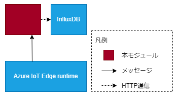

# InfluxDBRegister

## 目次
* [概要](#概要)
* [機能](#機能)
* [Quick Start](#quick-start)
* [イメージのURL](#イメージのurl)
* [動作保証環境](#動作保証環境)
* [Deployment 設定値](#deployment-設定値)
  * [環境変数](#環境変数)
  * [Desired Properties](#desired-properties)
  * [Create Option](#create-option)
  * [startupOrder](#startuporder)
* [受信メッセージ](#受信メッセージ)
  * [Message Body](#message-body)
  * [Message Properties](#message-properties)
* [送信メッセージ](#送信メッセージ)
* [Direct Method](#direct-method)
  * [SetLogLevel](#setloglevel)
  * [GetLogLevel](#getloglevel)
* [ログ出力内容](#ログ出力内容)
* [ユースケース](#ユースケース)
  * [ケース ①](#Usecase1)
  * [ケース ②](#Usecase2)
* [Feedback](#feedback)
* [LICENSE](#license)

## 概要
InfluxDBRegisterは、入力されたメッセージをInfluxDBに格納するAzure IoT edgeモジュールです。

## 機能

* 入力されたメッセージをInfluxDBに格納する



## Quick Start
1. Personal Accese tokenを作成
（参考: [個人用アクセス トークンを管理する](https://docs.github.com/ja/authentication/keeping-your-account-and-data-secure/managing-your-personal-access-tokens)）

2. リポジトリをクローン
```
git clone https://github.com/Project-GAUDI/InfluxDBRegister
```

3. ./src/nuget_template.configの<GITHUB_USERNAME>と<PERSONAL_ACCESS_TOKEN>を自身のユーザー名とPersonal Accese tokenに書き換えて、ファイル名をnuget.configに変更してください

4. Dockerイメージをビルド
```
docker image build -t <IMAGE_NAME> ./InfluxDBRegister/src/
```
例）
```
docker image build -t ghcr.io/<YOUR_GITHUB_USERNAME>/influxdbregister:<VERSION> ./InfluxDBRegister/src/
```

5. Dockerイメージをコンテナレジストリにプッシュ
```
docker push <IMAGE_NAME>
```
例）
```
docker push ghcr.io/<YOUR_GITHUB_USERNAME>/influxdbregister:<VERSION>
```

6. Azure IoT edgeで利用

## イメージのURL
準備中

| URL                                                         | Description         |
| ----------------------------------------------------------- | ------------------- |

## 動作保証環境

| Module Version | IoTEdge | edgeAgent | edgeHub  | amd64 verified on | arm64v8 verified on | arm32v7 verified on |
| -------------- | ------- | --------- | -------- | ----------------- | ------------------- | ------------------- |
| 6.0.0-rc1      | 1.5.0   | 1.5.6     | 1.5.6    | ubuntu22.04       | －                  | －                  |

## Deployment 設定値

### 環境変数

#### 環境変数の値

| Key                       | Required | Default | Recommend | Description                                                     |
| ------------------------- | -------- | ------- | --------- | ---------------------------------------------------------------- |
| URI                       | 〇       |         |           | HTTP リクエストする influxdb アドレス。                                                        |
| DBName                    | 〇       |         |           | 問い合わせとデータ投入を行う influxdb の DB 名。                                               |
| Interval                  | 〇       |         |           | influxdb の書き込み処理間隔(秒)。                                                                  |
| TransportProtocol         |          | Amqp    |           | ModuleClient の接続プロトコル。<br>["Amqp", "Mqtt"] |
| LogLevel                  |          | info    |           | 出力ログレベル。<br>["trace", "debug", "info", "warn", "error"] |

### Desired Properties

#### Desired Properties の値

| JSON Key                      | Type    | Required | Default   | Description |
| ----------------------------- | ------- | -------- | --------- | --------------------------------------------------- |
| dbparam[x]                    | object  | 〇       |           | [x]は連番の数字<br>監視するメッセージ情報。 |
| &nbsp; input                  | string  | 〇       |           | 受信するメッセージのインプット名。 |
| &nbsp; measurement            | string  | 〇       |           | influxdb の書き込み先テーブル名。 |
| &nbsp; use_header             | boolean | 〇       |           | 受信するメッセージの RecordHeader 部の値使用可否。 |
| &nbsp; use_data               | boolean | 〇       |           | 受信するメッセージの RecordData 部の値使用可否。 |
| &nbsp; set_usertimestamp      | boolean | 〇       |           | false:ユーザ
  set_usertimestamp	boolean	〇		false:ユーザタイムタイムスタンプを指定しない。DB 挿入時の時刻をタイムスタンプとする。<br>true:ユーザタイムスタンプを指定する。以下の有効順の設定項目に従って、タイプスタンプを設定する。 <br> &nbsp; 有効順: timestamp_index |
| &nbsp; timestamp_index        | string  | 〇       |           | ユーザタイムスタンプとして登録する入力データのインデックス（カラム番号：１～）を指定。 |
| &nbsp; field_data_type        | string  |          | automatic | データの保存タイプを指定する。<br>&nbsp; "string_all": 全て文字列データとして保存する。<br>&nbsp; "automatic":自動決定。入力データの状態のまま保存する。動作は、InfluxDB の仕様に準じる。(※1) |
| &nbsp; tags                   | object  | 〇       |           | influxdb に格納するタグ名称を列挙。 |
| &nbsp;&nbsp; tag 設定方法 1  |         |          |           | |
| &nbsp;&nbsp; tag[y]           | string  | 〇       |           | [y]は 1 から始まる連番<br>MessageProperty 名を指定。 |
| &nbsp;&nbsp; tag 設定方法 2  |         |          |           | |
| &nbsp;&nbsp; tag[y]           | object  | 〇       |           | [y]は 1 から始まる連番<br>MessageProperty 名と行番号のセットを指定。 |
| &nbsp;&nbsp;&nbsp; tag_name   | string  | 〇       |           | MessageProperty 名。 |
| &nbsp;&nbsp;&nbsp; value_type | string  | 〇       |           | MessageProperty: プロパティ値を出力<br>MessagePropertyAndRowIndex: プロパティ値に行番号を加算した値を出力。 |

#### Desired Properties の記入例

```json
{
  "dbparam1": {
    "input": "cfrOut1",
    "measurement": "measurement1",
    "use_header": false,
    "use_data": true,
    "set_usertimestamp": true,
    "timestamp_index": 1,
    "field_data_type": "automatic",
    "tags": {
      "tag1": "col1",
      "tag2": {
        "tag_name": "col2",
        "value_type": "MessageProperty"
      }
    }
  }
}
```

### Create Option

#### Create Option の値

なし

#### Create Option の記入例

```json
{}
```

### startupOrder

#### startupOrder の値

| JSON Key      | Type    | Required | Default | Recommend | Description |
| ------------- | ------- | -------- | ------- | --------- | ----------- |
| startupOrder  | uint    |  | 4294967295 | 300 | モジュールの起動順序。数字が小さいほど先に起動される。<br>["0"から"4294967295"] |

#### startupOrder の記入例

```json
{
  "startupOrder": 300
}
```

## 受信メッセージ

### Message Body

| JSON Key            | Type   | Description        |
| ------------------- | ------ | ------------------ |
| RecordList          | object |                    |
| &nbsp; RecordHeader | array  | ヘッダーレコード   |
| &nbsp; RecordData   | array  | 1 レコードのデータ |

### Message Properties

任意

## 送信メッセージ

なし

## Direct Method

### SetLogLevel

* 機能概要

  実行中に一時的にLogLevelを変更する。<br>
  変更はモジュール起動中または有効時間を過ぎるまで有効。<br>

* payload

  | JSON Key      | Type    | Required | default | Description |
  | ------------- | ------- | -------- | -------- | ----------- |
  | EnableSec     | integer  | 〇       |          | 有効時間(秒)。<br>-1:無期限<br>0:リセット(環境変数LogLevel相当に戻る)<br>1以上：指定時間(秒)経過まで有効。  |
  | LogLevel      | string  | △       |          | EnableSec=0以外を指定時必須。指定したログレベルに変更する。<br>["trace", "debug", "info", "warn", "error"]  |

  １時間"trace"レベルに変更する場合の設定例

  ```json
  {
    "EnableSec": 3600,
    "LogLevel": "trace"
  }
  ```

* response

  | JSON Key      | Type    | Description |
  | ------------- | ------- | ----------- |
  | status          | integer | 処理ステータス。<br>0:正常終了<br>その他:異常終了         |
  | payload          | object  | レスポンスデータ。         |
  | &nbsp; CurrentLogLevel | string  | 設定後のログレベル。（正常時のみ）<br>["trace", "debug", "info", "warn", "error"]  |
  | &nbsp; Error | string  | エラーメッセージ（エラー時のみ）  |

  ```json
  {
    "status": 0,
    "paylaod":
    {
      "CurrentLogLevel": "trace"
    }
  }
  ```

### GetLogLevel

* 機能概要

  現在有効なLogLevelを取得する。<br>
  通常は、LogLevel環境変数の設定値が返り、SetLogLevelで設定した有効時間内の場合は、その設定値が返る。<br>

* payload

  なし

* response

  | JSON Key      | Type    | Description |
  | ------------- | ------- | ----------- |
  | status          | integer | 処理ステータス。<br>0:正常終了<br>その他:異常終了         |
  | payload          | object  | レスポンスデータ。         |
  | &nbsp; CurrentLogLevel | string  | 現在のログレベル。（正常時のみ）<br>["trace", "debug", "info", "warn", "error"]  |
  | &nbsp; Error | string  | エラーメッセージ（エラー時のみ）  |

  ```json
  {
    "status": 0,
    "paylaod":
    {
      "CurrentLogLevel": "trace"
    }
  }
  ```

## ログ出力内容

| LogLevel | 出力概要 |
| -------- | -------- |
| error    | [初期化/desired更新/desired取り込み/メッセージ受信]失敗         |
| warn     | エッジランタイムとの接続リトライ失敗<br>環境変数の1部値不正         |
| info     | 環境変数の値<br>desired更新通知<br>環境変数の値未設定のためDefault値適用<br>メッセージ[送信/受信]通知         |
| debug    | 無し     |
| trace    | メソッドの開始・終了<br>受信メッセージBody  |

## ユースケース

<a id="Usecase1"></a>

### ケース①

不定期間隔でアップロードされるCSVファイルのデータをInfluxDBに格納時の時刻で格納する。


#### desiredProperties

```JSON
{
  "dbparam1": {
    "input": "input1",
    "measurement": "sensor",
    "use_header": false,
    "use_data": true,
    "set_usertimestamp": false,
    "field_data_type": "string_all",
    "tags": {
      "tag1": "type",
      "tag2": {
        "tag_name": "row_number",
        "value_type": "MessagePropertyAndRowIndex"
      },
        "tag3": "shot_count",
    }
  }
}

```

#### 環境変数

| 名称                | 値                   |
| ------------------- | -------------------- |
| URI                 | http://influxdb:8086 |
| DBName              | example              |
| Interval            | 2                    |
| TransportProtocol   | Amqp                 |
| LogLevel            | debug                |
| DefaultReceiveTopic | Iothub               |
| M2MqttFlag          | false                |
| SasToken            | ""                   |
| TZ                  | Asia/Tokyo           |

#### 出力結果

InfluxDBのレコード

出力例: InfluxDBの格納データ

| DB      | measurement | time                | tag  |            |            | field                 |       |      |      |
| ------- | ----------- | ------------------- | ---- | ---------- | ---------- | --------------------- | ----- | ---- | ---- |
| example | sensor      | 2022/07/15 10:00:00 | type | row_number | shot_count | "2021/07/15 11:00:00" | "AAA" | ...  | "10" |
|         |             | 2022/07/15 10:00:01 | data | 1          | 1          | "2021/07/15 11:00:03" | "AAB" | ...  | "10" |
|         |             | 2022/07/15 10:00:02 | data | 2          | 1          | "2021/07/15 11:00:05" | "ABA" | ...  | "10" |
|         |             | 2022/07/15 10:00:03 | data | 3          | 1          | "2021/07/15 11:00:09" | "ABB" | ...  | "10" |
|         |             | 2022/07/15 10:00:04 | eof  | 4          | 1          | None                  | None  | None | None |

<a id="Usecase2"></a>

### ケース②

不定期間隔でアップロードされるCSVファイルのデータをInfluxDBに格納データの時刻で格納する。


#### desiredProperties

```JSON
{
  "dbparam1": {
    "input": "input1",
    "measurement": "sensor",
    "use_header": false,
    "use_data": true,
    "set_usertimestamp": true,
    "timestamp_index": 1,
    "field_data_type": "automatic",
    "tags": {
      "tag1": "type",
      "tag2": {
        "tag_name": "row_number",
        "value_type": "MessagePropertyAndRowIndex"
      },
        "tag3": "shot_count",
    }
  }
}

```

#### 環境変数

| 名称                | 値                   |
| ------------------- | -------------------- |
| URI                 | http://influxdb:8086 |
| DBName              | example              |
| Interval            | 2                    |
| TransportProtocol   | Amqp                 |
| LogLevel            | debug                |
| DefaultReceiveTopic | Iothub               |
| M2MqttFlag          | false                |
| SasToken            | ""                   |
| TZ                  | Asia/Tokyo           |

#### 出力結果

InfluxDBのレコード

出力例: InfluxDBの格納データ

| DB      | measurement | time                | tag  |            |            | field                 |      |      |
| ------- | ----------- | ------------------- | ---- | ---------- | ---------- | --------------------- | ---- | ---- |
| example | sensor      | 2021/07/15 11:00:00 | type | row_number | shot_count | "2021/07/15 11:00:00" | ...  | 10   |
|         |             | 2021/07/15 11:00:03 | data | 1          | 1          | "2021/07/15 11:00:03" | ...  | 10   |
|         |             | 2021/07/15 11:00:05 | data | 2          | 1          | "2021/07/15 11:00:05" | ...  | 10   |
|         |             | 2021/07/15 11:00:09 | data | 3          | 1          | "2021/07/15 11:00:09" | ...  | 10   |
|         |             | 2021/07/15 11:00:14 | eof  | 4          | 1          | None                  | None | None |


## Feedback
お気づきの点があれば、ぜひIssueにてお知らせください。

## LICENSE
FileCleaner is licensed under the MIT License, see the [LICENSE](LICENSE) file for details.
